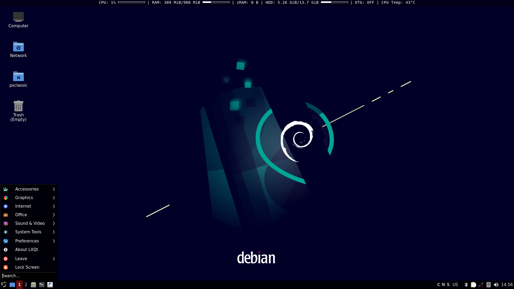
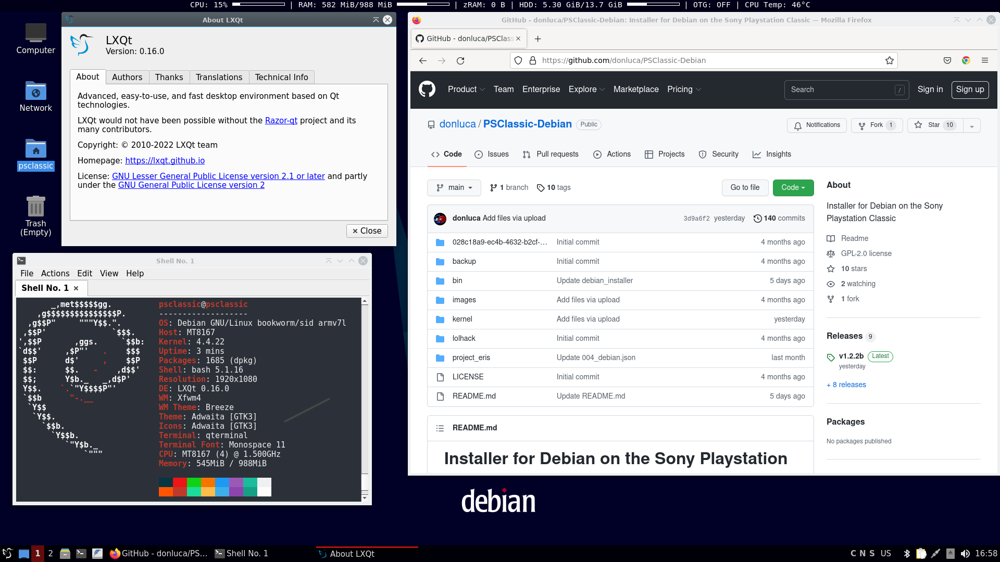

# Installer for Debian on the Sony Playstation Classic

**This software comes with ABSOLUTELY NO WARRANTY, to the extent permitted by applicable law.**

## What is this?

Got a Playstation Classic gathering dust somewhere in your room?  
Nice, you can now transform it in a fully fledged Debian Linux PC rocking the LXQt Desktop Environment!  
The hardware in the Playstation Classic isn't half bad, the Mediatek MT8167 gives us 4 cores of ARM Cortex A35 which are right up the alley of a Raspberry Pi 3, along with 1GB of RAM and 16GB of eMMC which are both a bit limiting, but not the end of the world.  
There's also a very capable GPU which has been the bane of my existence, hence we don't talk about that here.

## Limitations and issues

- **YOUR GAME PARTITION WILL BE BACKED UP AND ERASED, YOU WON'T HAVE YOUR GAMES ON INTERNAL MEMORY ANYMORE BECAUSE THAT'S WHERE DEBIAN WILL LIVE IN YOUR PLAYSTATION CLASSIC. DESPITE THIS YOU'LL BE ABLE TO GO BACK TO STOCK AT ANY TIME (read on...)**
- **It is currently untested on the Japanese version of the Playstation Classic (and those sold in Taiwan and Hong Kong).** There could be a small issue when restoring the games. You won't lose them, but you might find that one of the games won't be restored correctly. Testers needed. If you own a JAP PSC, please try to install Debian, restore to stock and report back.
- **1GB of RAM:** this will allow you to run very few things at a time. There's no swap memory because putting swap on non-replaceable eMMC storage is a VERY BAD IDEA™.
If you're in desperate need of more RAM, you can try using zRAM to better manage your memory at the cost of a bit of CPU power. You can find this under the main menu, System Tools, which will enable a 256MB zRAM. You can alter the amount of zRAM by editing the enableZRAM script in /usr/local/bin. After boot, you'll have roughly 750MB of RAM free (yeah, this installation of Debian is pretty lightweight)
- **~10GB of free space:** you'll want to use external/network storage if you plan on loading lots of software and documents on the internal memory.
- **No hardware video acceleration:** the proprietary drivers provided in the stock firmware are a complete trainwreck and only partly work in Wayland (mainly because they are incomplete, there are several libraries referenced which are missing) and have been the source of infinite pain and despair on my part. GPU acceleration is technically possible and I achieved it with a mish-mash of old proprietary libraries using Weston under Wayland, but even then, having applications work properly was a coinflip.
- **Forget about videos:** with no hardware acceleration even 240p videos will stutter and will be basically unplayable. There's support for Video4Linux in the kernel and I haven't experimented with it, so feel free to tinker around and see if you manage to come up with something useable.
- **USB drivers are nearly unuseable:** they are so bad that you must be careful about using USB hubs and connecting several devices, otherwise the kernel will panic and the system will freeze. Some devices like USB Audio interfaces won't work properly or at all (at least the ones I have didn't), but, as far as I could tell, USB drives, ethernet/wireless dongles and bluetooth should all work fine. YMMV.
- **Only 2 USB ports:** as said above, be mindful of connecting several devices through a USB hub.
- **1080p max:** Considering that the stock firmware runs at 720p (and you can't change it), this is already an improvement. But this is also the max resolution the GPU supports. Don't try going further or you'll get a garbled screen.  
- **No bootscreen:** I've decided to use a "safe" kernel as default which has the framebuffer console disabled because it was causing kernel panics and bootloops. What this means in laymen terms is that you won't see the boot happening on screen: when the Debian is done booting, you'll find yourself straight to the desktop.  
- **OTG Support is iffy:** OTG support is baked into the kernel, but it's kind of broken. Once you enable it, you won't be able to use RNDIS or MIDI or any other USB function and the only way to go back to normal device mode is... to reboot. Yes, it sucks. Still you can access it from the main menu in LXQt, under System Tools.
- Finally... this is not something for the fainthearted. If you screw up, prepare to know how to access fastboot ( https://www.youtube.com/watch?v=o05HpHTwLuw ) to go to a recoverable state and flash back your original kernel. Bonus points if you're knowledgeable in Linux. If you're feeling scared at this point, messing around with this is probably not what you want to be doing.
  

## What do you need?
- A Playstation Classic (duh)
- (Optional, but highly recommended) Project Eris installed in your Playstation Classic. Without it you won't be able to go back and forth from Debian to stock firmware and viceversa. Most importantly, with Project Eris not having your games in the internal memory won't matter anymore bacause you can load them from anywhere (ie: USB drive, network share, etc.). For more information about Project Eris and how to install it go here: https://modmyclassic.com/project-eris/
- (Optional, but highly recommended) Either a **POWERED** USB hub or a mod to your Playstation Classic USB ports to remove the current limit. See here for a how to: https://modmyclassic.com/wiki/index.php?title=PlayStation_Classic#USB_Current_Limiting or via a Youtube video: https://www.youtube.com/watch?v=YU8M_2c2DGc
- A USB drive formatted to FAT32 and labelled SONY with at least 20GB of free space.
- (Optional) A network USB adapter for internet access, either wired or wireless. Most should work but to be on the safe side, use a USB2.0 one which has Linux support (the manufacturer should state whether it works with Linux or not)
- Patience

## How to install Debian
- Did I already say that you'll lose your internal games, although those will be backed up so you can go back to stock at any time?
- **YOUR GAME PARTITION WILL BE BACKED UP AND ERASED, YOU WON'T HAVE YOUR GAMES ON INTERNAL MEMORY ANYMORE BECAUSE THAT'S WHERE DEBIAN WILL LIVE IN YOUR PLAYSTATION CLASSIC. DESPITE THIS YOU'LL BE ABLE TO GO BACK TO STOCK AT ANY TIME (if everything went well)**
- Download the latest Release available (right column) and make sure to download the file named "PSCDebian.zip" and **NOT THE SOURCE CODE** and **DO NOT DOWNLOAD BY CLONING THIS REPO OR GOING TO "CODE -> DOWNLOAD ZIP". IT WILL NOT WORK AND YOU'LL BRICK YOUR PLAYSTATION CLASSIC**
- Format your USB drive as FAT32 and label it SONY. Afterwards, unzip the file you've just downloaded in the USB drive so that at the root you have the various folders such as backup, bin, kernel, etc. Again, they must be at the root of your USB drive. If at the root of your USB drive there's a folder and inside that folder there are all the other folders you see in this repo it will not work
- Boot your Playstation Classic and wait until it reaches the main screen
- Unplug all your USB devices (except for the power cable, of course – Capt. Obvious)
- Plug the USB drive
- Shortly after, you should see the power leds blink and the screen should go black and stuff will start to appear on screen: pay close attention to what's being written because it will tell you step by step what is happening. The process will take a long time, ranging from 1 hour up to several hours depending on how fast your USB drive is.
- If at any point the whole system freezes, read the troubleshooting section below to know what to do
- If everything went well, you can unplug the power, unplug the USB drive, plug mouse and keyboard and plug the power cable and after a short time (it generally takes 10 to 20 seconds to boot) you should be in LXQt
- Enjoy messing around in Linux!

### Extra steps for people using Project Eris, so they can reboot back into Debian
- Copy the following files from the Debian installer USB drive over to your USB Drive which has Project Eris:
- From /project_eris/004_debian.json  to the Project Eris USB Drive /project_eris/etc/boot_menu/boot_items"
- From /project_eris/DB.png  to the Project Eris USB Drive /project_eris/etc/project_eris/IMG"
- From /project_eris/DB_Hover.png  to the Project Eris USB Drive /project_eris/etc/project_eris/IMG"

## Extra functions
- **Manually reboot from stock firmware to Debian:** let's say you did a mistake in Debian and rebooted to stock firmware without having first installed Project Eris and you're now stuck in stock firmware without games: no worries! Create a file or folder at the root of the USB drive you created to install Debian called BOOT, let stock firmware boot completely up to the main screen, plug the USB Drive and after a brief time it will reboot you back into Debian.
- **Force Debian installation:** if you somehow messed up your Debian installation, you can overwrite your Debian installation with the stock one by creating a file or folder at the root of the USB drive you created to install Debian called FORCE, let stock firmware boot completely up to the main screen, plug the USB Drive and after a brief time it will start the installation process from scratch. **BE CAREFUL THAT THIS PROCESS WILL DELETE YOUR GAMES' PARTITION WITHOUT BACKING IT UP FIRST!!!**
- **Restore stock firmware with all your games:** if at any point you want to go back to the stock firmware with all your games, you can do so by creating a file or folder at the root of the USB drive you created to install Debian called RESTORE, reboot into stock firmware and let stock firmware boot completely up to the main screen, plug the USB Drive and after a brief time it will start the restore process. **BE CAREFUL THAT THIS PROCESS WILL WIPE YOUR DEBIAN INSTALLATION WITHOUT BACKING IT UP**   
- **Flash your custom kernel:** If you really know what you're doing and you've cooked a custom kernel... then you can name it custom.img and put in the kernel folder of your Debian USB drive and create a file or folder named FLASH at the root of your USB drive. It will first backup your current kernel (unless you already have a backup of it) and then flash your custom kernel.  
- **Just mess around with a shell:** if all you need is just a shell to input commands, create a file or folder named SHELL at the root of your USB drive. Be careful that you'll be using the root user so you can do whatever you want, including blowing your own system up. From great powers come great responsibilities, etc. etc.

## Troubleshooting
The whole system has a billion safety checks in place, so it's most likely that you won't be able to install Debian at all because the installation script will detect something that could potentially brick your Playstation Classic and stop without doing anything, rather then going on and at some point break and leave you with an unuseable system.  
Anyway... there's some stuff which may go wrong (there always is) so here we go.
- **The installation process doesn't start or hangs:** this is a scenario which is very likely to happen and it's because you have not used a powered USB hub, you haven't modded the USB ports of the Playstation Classic or your USB drive draws too much power. **Solution:** either use a powered USB hub (as suggested) or try with another USB drive which will hopefully draw less power.
- **You mess up the system by installing Debian FIRST and Project Eris LATER:** it's not really a mess up and it's very easy to solve. Just use the Debian installer USB Drive and follow the steps for manually rebooting into Debian (see above). It will install the Debian kernel overwriting the Project Eris one. Project Eris is compatible with the Debian kernel.
- **You mess up your Debian installation and all you get now is a black screen:** You have to open your Playstation Classic and do what's shown in this Youtube video to enable fastboot https://www.youtube.com/watch?v=o05HpHTwLuw and then you have to use fastboot to flash back the psc.img kernel (which you can find in the folder kernel) to the BOOTIMG1 partition. If you don't know how to install or use fastboot, this could be a good starting point: https://forum.xda-developers.com/t/official-tool-windows-adb-fastboot-and-drivers-15-seconds-adb-installer-v1-4-3.2588979/ . At this point you'll be able to boot to stock kernel and from there you can force a re-installation of Debian in a clean state (check the "Extra functions" section above).
- **Boot time takes forever:** It generally takes 10-20 seconds to boot from power on to desktop. If you find yourself with a black screen and the green led blinking (meaning that it's booting) and it takes 2-3 minutes to boot, that means you probably have a wired network connection with the cable unplugged. To solve this, edit the /etc/network/interfaces file and remove the line "auto eth0" and reboot. It should now boot normally, but you might experience some anomalies when using your wired network connection.

# Curiosities and cute things you can do with Debian on the Playstation Classic

## You don't really need an USB network adapter
Debian on Playstation Classic has an RNDIS network interface included by default in the kernel which works via USB.  
You can enable it by going to the main menu under "System Tools".  
Instead of connecting the Playstation Classic to a wall charger to power it, connect it to a **good** (ie: that can provide enough power) USB port on your PC/Mac and once Debian has booted, you'll find a new network interface on Windows/Mac named "Android". You can use it to connect to the Playstation Classic in several ways (for example via SSH) and you can also give the Playstation Classic internet access through it. Bear in mind that the RNDIS interface has no DHCP server working on it, so it will have an auto-assigned IP unless your PC is serving an IP address. If you have issues communicating between your PC and the PSC, just set static IP addresses to both in the same subnet (ie: your PC 192.168.42.1 and your PSC 192.168.42.2, both subnet 255.255.255.0)  
On Windows you're going to need drivers to make the RNDIS ethernet adapter appear, you can get them from here: https://evwiki.ensto.technology/display/CHWI/Install+RNDIS+Driver+for+Windows+to+be+able+to+connect+to+charge+controller  

## Use it as a USB Roland MT-32/General MIDI/MIDI box Emulator
  

  
Recently there has been a spike in popoularity of old MIDI modules such as the classic Roland MT-32 and Roland GS modules, to the point where people have created emulators of such boxes using, for example, a Raspberry Pi: https://github.com/dwhinham/mt32-pi  
If you ever wanted such a device, congrats, you already have one.  
There are two ways you can use the Playstation Classic as a MIDI emulator box: either via USB (if you connect it to, say, a PC/Mac/MiSTer FPGA/Raspberry Pi/etc.) or you'll need a cheap USB-MIDI adapter for your old 486/Pentium computer so that you can connect it via MIDI/Gameport to the Playstation Classic.  
The USB way is a breeze and will work great with software like SCUMMVM ( https://www.scummvm.org ) on your modern machine or on MiSTer FPGA.  
To enable MIDI over USB follow those simple steps:
- If you want to use the MT-32 Emulator, launch it from LXQt main menu -> Sound & Video -> MT-32 Emulator and add the necessary ROM files (Google is your friend)
- If you want to use General MIDI/GS/anything else which uses soundfonts, launch QSynth (which is the GUI for Fluidsynth) from LXQt main menu -> Sound & Video -> Qsynth
- In the main menu of LXQt, go to Audio and Video and select "Enable MIDI over USB". It will ask for your password and shortly after you'll find on your PC a new MIDI Device called Android. It is automatically recognized on Windows (even on Windows 98!), macOS and Linux, without the need of additional drivers.
- Just one extra step for MT-32: Click on the + sign under MIDI Input and choose midi2 and click ok.
- And that's pretty much it. Remember to choose the Android midi device on your PC/Mac as MIDI output on SCUMMVM/DOSBox/etc. and you're ready to go.
- Please note that by enabling MIDI over USB you'll disable RNDIS as only one service can be active at one time via USB. You can enable RNDIS after you've finished playing around with MIDI from LXQt main menu -> System Tools -> Enable RNDIS over USB
- Finally, one last note: the Playstation Classic has only one HDMI output which means that audio will come out of the HDMI connector in digital form. You can either connect your monitor's headphone/line output to the input of the monitor you're playing on (or your stereo system) or use an HDMI Audio extractor dongle which will let you grab analog audio from the HDMI connector and, from there, redirect it anywhere you want. Some more advanced TVs may also have internal audio routing; so, say you have the Playstation Classic on HDMI1 input and your main PC/MiSTer/whatever outputting on HDMI2, you may be able to route internally HDMI1 audio to HDMI2. As always, YMMV.

## Acknowledgments
This whole thing has taken more than 2 years to come to this point and it wouldn't have been possible without the work of honeylab ( https://honeylab.hatenablog.jp ) and Project Eris ( https://modmyclassic.com/project-eris/ ) and the infinite patience of several members of the Project Eris Discord, especially notv37, Compcom, Gorsonw, pon and WavApps.  
Gorsonw managed to succeed in making the console framebuffer work (although it's a bit wonky and sometimes it kernel panics during boot), which is an impressive feat and something I've miserably failed at despite working on it for an entire month before calling it quits.  
The hack which this installer is based on is called lolhack and you can find it here: https://github.com/justMaku/gpghax  
The Linux kernel sources used to build the custom kernel are available at https://doc.dl.playstation.net/doc/psclassic-oss/Linux-kernel.html

And that should cover it.  
Also **PLEASE** don't open issues here related to "how do I do this on Debian".  
This Debian installation is almost identical (excpet it runs on ARM and not on x86) to what you'd find on a normal PC so just Google your issue or search on StackOverflow.  

## What's next?
There will be no more work on this project (at least from my part) because the limitations due to the borked (and outdated) kernel we have would make any effort worthless.  
The next logical step would be trying to get mainline kernel working on the PSC to finally have proper USB drivers, video acceleration, etc. and there's already support for the MT8167 platform.
I've already tried my hand at using mainline kernel and it "works" in the sense that it boots but then it just stops dead because it's unable to detect the internal eMMC, the USB ports, the HDMI output... everything.  
If there's anyone out there who wants to bring this work to the next level, please consider focusing your efforts in making mainline kernel work because that would unlock the full potential of the Playstation Classic.
Once we have proper GPU support and proper USB drivers, this thing is really going to fly.  

Until then, thank you for trying this proof of concept out and happy tinkering!
